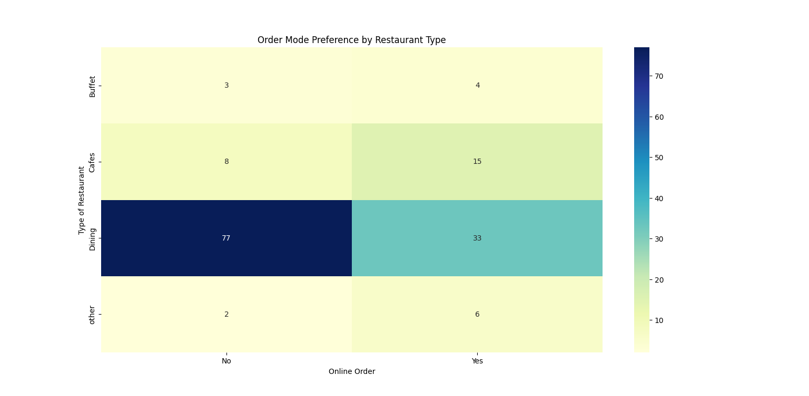

# Zomato Data Analysis

This project performs exploratory data analysis (EDA) on Zomato restaurant data to uncover insights about restaurant types, votes, ratings, online order availability, and cost preferences. Visualizations are created using Matplotlib and Seaborn for better understanding of patterns and trends.

## ⚙️ Steps & Analysis

1. Data Cleaning

- Ratings (rate) were stored in the format 4.5/5.

- Converted them into float values for numerical analysis.

2. Restaurant Types

- Counted number of restaurants by type using Seaborn countplot.

- Aggregated total votes by restaurant type and visualized with a line plot.

3. Votes Analysis

- Identified the restaurant with the highest number of votes.

4. Online Order Availability

- Plotted count of restaurants offering online vs offline ordering.

5. Ratings Distribution

- Visualized the distribution of ratings using a histogram.

6. Cost Analysis

- Analyzed approximate cost for two people across restaurants with a countplot.

7. Online vs Offline Ratings

- Compared ratings for restaurants that allow online orders vs those that don’t using a boxplot.

8. Order Mode Preference by Restaurant Type

- Created a pivot table to compare online vs offline order preferences across restaurant types.

- Visualized using a heatmap

## 📊 Visualizations

- Countplots for restaurant types, costs, and online order availability.

- Line plot for votes by restaurant type.

- Histogram for ratings distribution.

- Boxplot comparing ratings based on online orders.

- Heatmap for order preferences across restaurant types.

## 🚀 How to Run

1. Clone this repository

   ```sh
   git clone https://github.com/Abhimanyusit/zomato_data_analysis.git
   cd zomato
   ```

2. Install dependencies

   ```sh
   pip install pandas numpy matplotlib seaborn
   ```

3. Place the dataset (Zomato-data.csv) in the content/ folder.

4. Run the script

   ```sh
   python main.py
   ```

## Requirements

- Python 3.x
- pandas
- matplotlib
- numpy
- seaborn

## Example Output


